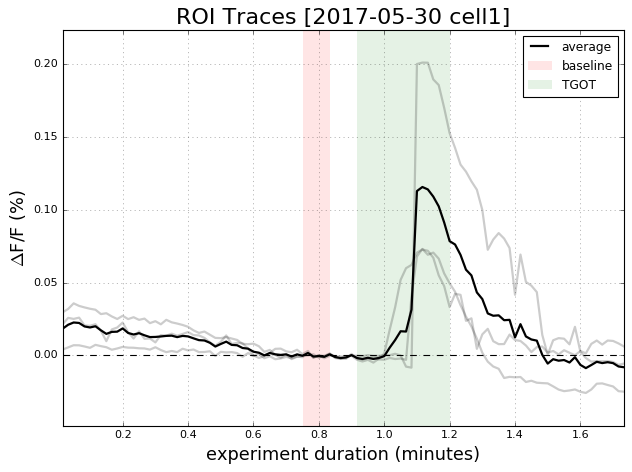

# Python Scripts for ROI/Video Analysis
These scripts are a sandbox of experimental code. The ultimate goal is to maximally automate analysis of time-series data.

### Simple Demo

### Video Render Demo
read original image file, ROI zip file, do the analysis, and output frames ready to create a video from

