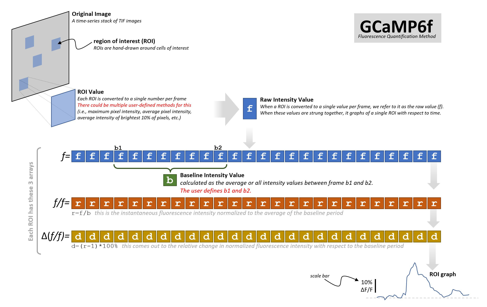
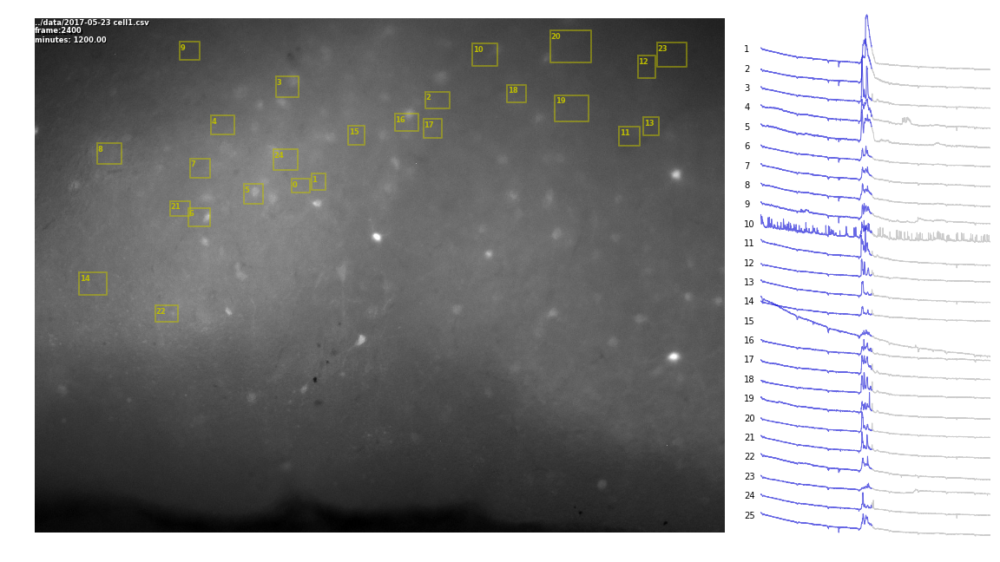

# ROI Analysis Pipeline
This collection of scripts aids in the automated analysis of large collections of TIFs (most likely fluorescent micrographs), taking ROI data (from FIJI/ImageJ), and reporting it as delta F/F. Additional tools are included which assist in the creation of video. An ultimate goal of this type of analysis is to provide a web-accessable front-end to the data immediately after it is acquired.

# Delta F/F Theory



# Example Output

## Figures


## Video
* https://www.youtube.com/watch?v=EEuXCMoRtsw
* https://www.youtube.com/watch?v=1OHvPi1TbII

# Workflow
This is a work in progress, but as of now the workflow is:

* 1 video experiment = 1 folder. Folder name format is like `2017-05-23 cell2`
* use Micro-Manager to image video (saving output as individual TIFs in this folder)
* this folder will also contain:
  * `experiment.txt` made by hand at the time of image acquisition
  * `RoiSet.zip` made with ImageJ
  * `Results.xls` made with ImageJ multi-measure
* Data analysis scripts:
  * `Results.xls` will always have mean pixel values for each ROI
  * `Results_B.xls` will contain (identically formatted) dF/F calculated by Beronica (R)
  * `Results_S.xls` will contain (identically formatted) dF/F calculated by Scott (Python)

### experiment.txt
Any line without an "=" in it is treated as a comment. Use these lines for notes about the slice. Any line with an "=" in it is a value or a pair of values (if separated by a "-" sign). A baseline is always required. Units are in frames.
```
GABA Cre / GCaMP6f injection / mPFC
baseline=3200-3400
TGOT=3500-3700
```
