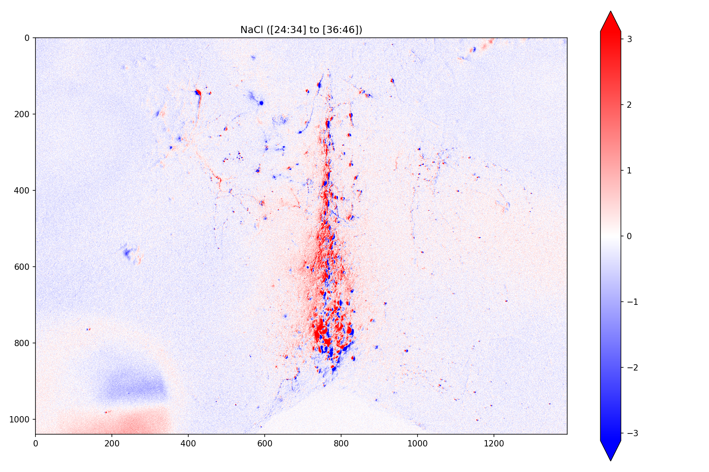

# ROI Analysis Pipeline
This project contains Python scripts and R packages written to facilitate analysis of fluorescent micrographs for the purpose of biomedical research. Although code in this project can be interacted with directly for the purpose of data exploration, care is taken to ensure these scripts can also be run in a fully-automated manner allowing them to serve as individual component in a data analysis pipeline or be executed by a web-based data browsing front-end (i.e., [SWHLabPHP](https://github.com/swharden/SWHLabPHP)). Data analyzed by these routines are typically related to calcium reporting fluorophores (i.e., Fluo-4, Fluo-4 AM, Fluo-5, GCaMP6) obtained with a traditional epifluroesecnce or two-photon scanning laser microscope.

These projects are collaboratively written and maintained by [Scott Harden](https://github.com/swharden) and [Beronica Ocasio](https://github.com/beronicao).

Project | Description
---|---
**[boshROI](boshROI)** | R Package designed to analyze cellular calcium signals (reported by GCaMP6f) from a time series of single-channel micrographs. ImageJ is used to draw regions of interest (ROIs), and this script loads the ROIs, analyzes the TIFs (using different image analysis methods), and generates delta F / F graphs. Code here is R-centric and not actively used.
**[pyROI](pyROI)** | Python scripts to generate annotated video (showing ROIs and graphs of analyzed data) from ROI data. Video output is HTML5-compatible MP4. Code here is actively used to analyze epifluorescence images for GCaMP6f experiments.
**[bosh2P](bosh2P)**  | R Package designed to analyze sub-cellular calcium transients in neurons from two-photon linescans simultaneously imaging Fluo-5f and Alexa Fluor 594. Calcium fluctuations are reported as the ratio of these two fluorophores.
**[pyLS](pyLS)** | Python scripts to generate dF/F graphs from linescan data. Code here is independent of (but complementary to) boshLS. Code here is actively used to analyze two-photon linescans.
**[pyFiber](pyFiber)** | Python scripts related to analysis of calcium signals using Doric photo photmetry equipment. Code here is under-developed and not actively used.
**[SWH2P](SWH2P)** | Python API to data created by PrairieView multiphoton imaging software.
**[imageDelta](imageDelta)** | Python script to create 2D arrays representing average baseline and drug images from a video folder (TIF series), then display the difference as a heatmap.

## Notes
### Convert a folder of BMP files to MP4
Export as an image series, BMP, named "frame", starting at 0, with 4 digits.
```
ffmpeg.exe -framerate 10 -y -i "C:/input/frame%%04d.bmp" -c:v libx264 -pix_fmt yuv420p "C:/output/file.mp4"
```

## Screenshots



