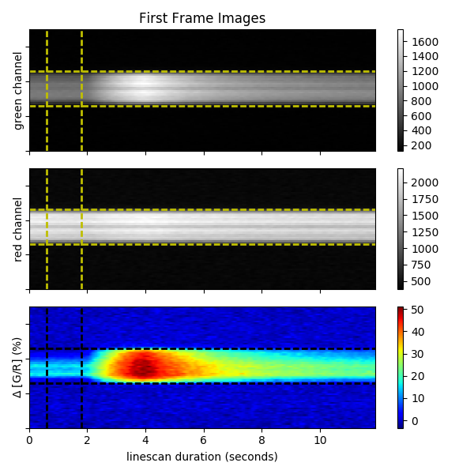
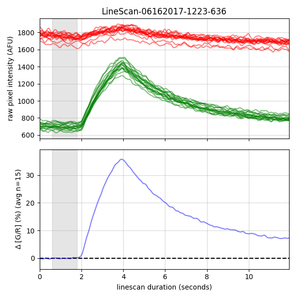

# ROI Analysis Pipeline
This project contains code (Python and R) for analyzing regions of interest (ROIs) in fluorescent micrographs. Analyses are typically related to calcium-sensitive fluorophores (Fluo-5, GCaMP6, etc.).

Project | Description
---|---
**[boshROI](boshROI)** | R Package designed to analyze cellular calcium signals (reported by GCaMP6f) from a time series of single-channel micrographs. ImageJ is used to draw regions of interest (ROIs), and this script loads the ROIs, analyzes the TIFs (using different image analysis methods), and generates delta F / F graphs. Code here is R-centric and not actively used.
**[pyROI](pyROI)** | Python scripts to generate annotated video (showing ROIs and graphs of analyzed data) from ROI data. Video output is HTML5-compatible MP4. Code here is actively used to analyze epifluorescence images for GCaMP6f experiments.
**[bosh2P](bosh2P)**  | R Package designed to analyze sub-cellular calcium transients in neurons from two-photon linescans simultaneously imaging Fluo-5f and Alexa Fluor 594. Calcium fluctuations are reported as the ratio of these two fluorophores.
**[pyLS](pyLS)** | Python scripts to generate dF/F graphs from linescan data. Code here is independent of (but complementary to) boshLS. Code here is actively used to analyze two-photon linescans.
**[pyFiber](pyFiber)** | Python scripts related to analysis of calcium signals using Doric photo photmetry equipment. Code here is under-developed and not actively used.
**[Prairie2P](SWH2P)** | Python API to data created by PrairieView multiphoton imaging software.
**[imageDelta](imageDelta)** | Python script to create 2D arrays representing average baseline and drug images from a video folder (TIF series), then display the difference as a heatmap.
**[ImageJ ROI Analysis](ijp)** | Python modules for analyzing ΔF/F data from CSV files created with ImageJ's multi-measure tool

## Sample

