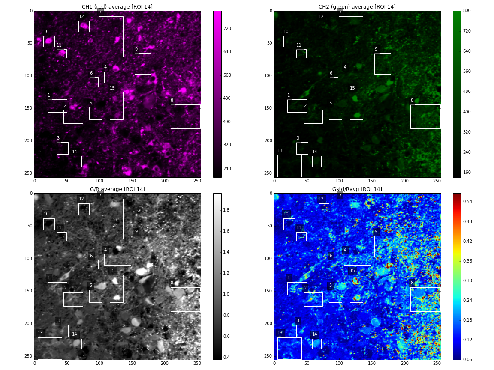
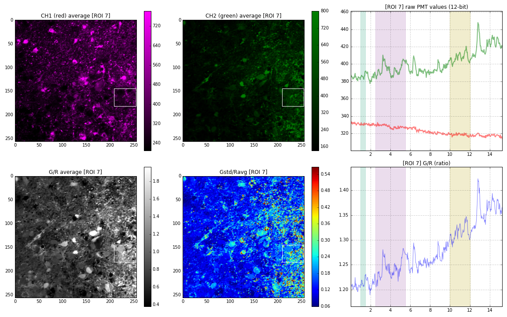
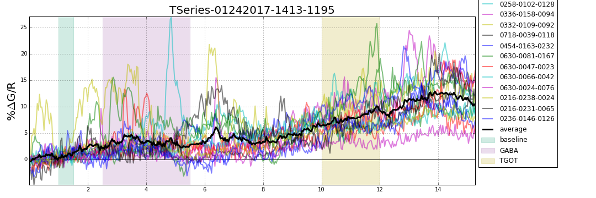
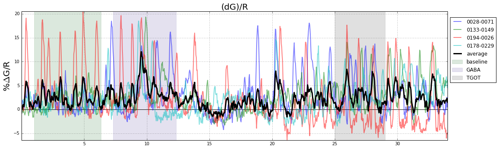
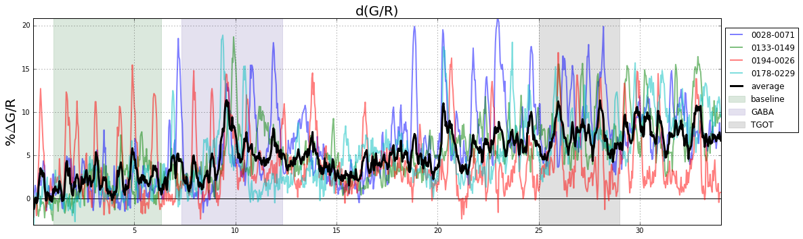

# SWH2P
**The swh2p package is a Python API to access and analyze data created by PrairieView multiphoton imaging software.** The ultimate goal of this package is to provide rapid access to data contained in prairieView folders, often in odd file formats. (i.e., a single 3D image is saved in hundreds of individual 16-bit TIFs which only contain 12-bit data)

## Installation
* copy the `swh2p` folder into your `Python/Lib/site-packages` folder.
* _If/when I make this a PyPi package, pip can be used to install and upgrade_

## Demonstration
[](https://www.youtube.com/watch?v=4z3JDsVqICE)

# API Features

## Time Series Calcium Imaging
* use ImageJ to create ROIs and save them as `RoiSet.zip` in the TSeries folder.
* add `experiment.txt` indicating baseline and drug times in the TSeries folder.
* Create a python script and point `swh2p.TS` to a TSeries folder.

#### Example Use Case
```python
import swh2p
swh2p.index_tseries_single("C:/path/to/TSeries-01272017-1255-1217")
```

|Description|Example|
|---|---|
|ROIs defined by ImageJ||
|ROI analysis (green/red)||
|average ROI signals||

## SingleImage Operations
_not yet implemented, but planning on having_
* automatic mutlichannel colorization
* file output in SWH2P folder for easy browsing

## Z-Stack Operations
_not yet implemented, but planning on having_
* single-file stack.tif creation (to speed X-drive access)
* merging of multiple 3D stacks into 1 large stack
* depth coding
* 3D deconvolution
* file output in SWH2P folder for easy browsing

## Misc:
- PrairieView manual http://loci.wisc.edu/sites/default/files/PrairieViewManual_5_2013.pdf

### dGoR formula notes
_in all cases, G and R are instaneous values, not averages._

|[dG]/R is good|d[G/R] is bad|
|---|---|
|  
