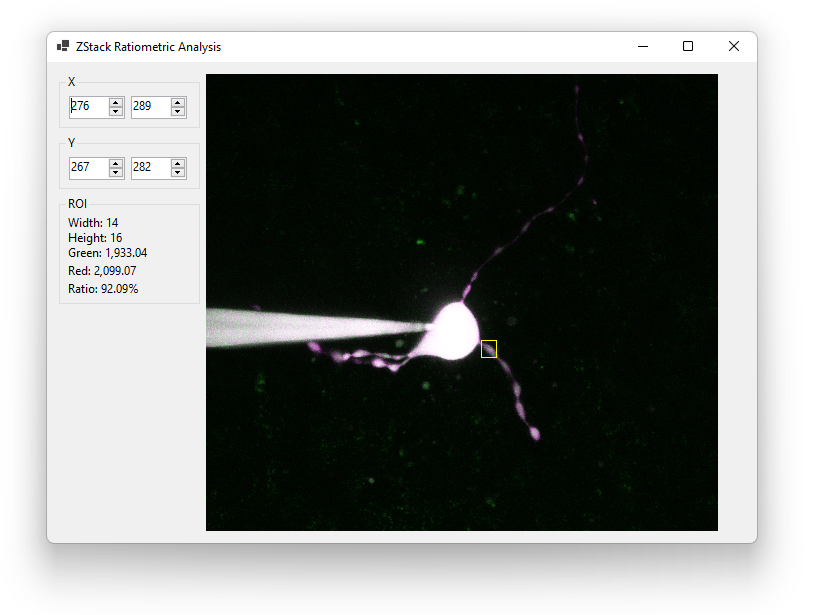

# ZRatio

ZRatio is a standalone WinForms app for reading PrairieView ZStack folders containing two-channel images, creating maximum projections, and displaying ratiometric analyses of regions of interest (ROIs).

