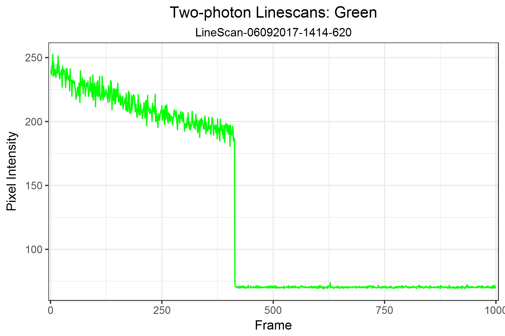
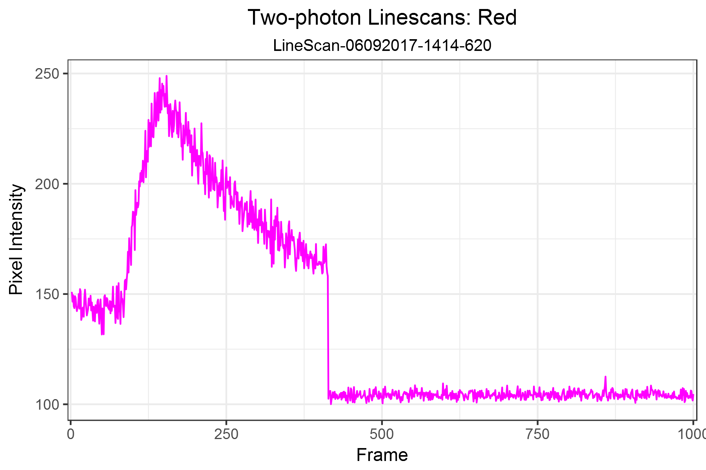
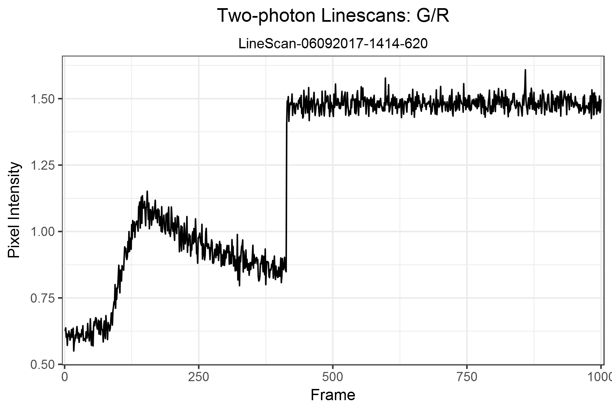

# bosh2P
bosh2P is an R package to assist in the quantification and analysis of Two-Photon imaging data. This package is ultimately intended to analyze the following types of two-photon data:
* linescan (X, T)
* time-series video (X, Y, T)
* Z-series stack (X, Y, Z)

# Setup 
bosh2P was developed and tested in [RStudio 1.0.143](https://www.rstudio.com/products/rstudio/) using [R 3.4.0](https://cran.rstudio.com/).

## Installing
To install the latest bosh2P package version from GitHub, use these commands:
```R
install.packages("devtools")
library(devtools)
devtools::install_github("swharden/ROI-Analysis-Pipeline", subdir = "bosh2P")
library(bosh2P)
```

## Uninstalling
```R
remove.packages("bosh2P")
```

## Updating
```R
library(devtools)
update_packages("bosh2P")
```

# Example Usage: Linescan Analysis
Ensure your working directory is the root of a directory containing the Two-Photon linescan files you wish to analyze. This can be done in Rstudio through the dropdown menu "Session" > "Set Working Directory" > "Choose Directory...", or via the command ```setwd()``` in R.  

```R
library(bosh2P)
setwd("~/GitHub/ROI-Analysis-Pipeline/data/linescan/realistic/LineScan-06092017-1414-620")
traces<-load_2ptiff()
norm<-norm_traces_LS(traces)
write.csv(norm, "demo.csv")

plot_2P_baseline(norm) + save_plot_2P(filename = "baseline_demo.png")
dev.off()

plot_2P_Ca(norm) + save_plot_2P(filename = "Ca_demo.png")
dev.off()

plot_2P_norm(norm) + save_plot_2P(filename = "GoRnorm_demo.png")
dev.off()

plot_2P_dGR(norm) + save_plot_2P(filename = "dGR_demo.png")
dev.off()
```







