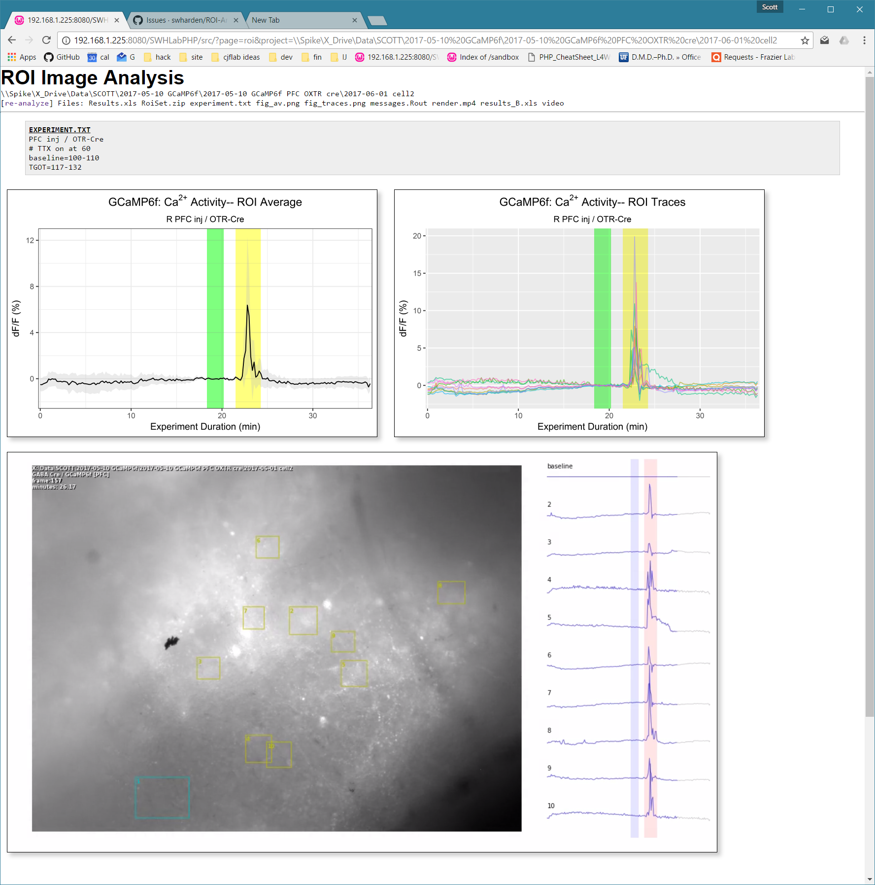

# Developer Notes

## R code base
R scripts here are maintained by Scott and Beronica. These scripts are designed to run "headless" from a server. They are written with modularization / code recycling as a priority. They are designed to be run with `RScript` and not interactively in RStudio.

## Setup
This section includes notes for setting up a developer environment to edit/run R scripts. RStudio is great for interactive testing, but I'd like to develop exclusively with `RScript.exe` since that's what the server will be calling.

## System Path
If you want to be able to type `rscript` in a command window, you have to edit the system environment variables to add the R/bin/ folder (containing RScript.exe) to your system PATH. On my computer it was `C:\Program Files\R\R-3.4.0\bin\`

## Notepad++
I like to edit code in Notepad++ and press F5 to run it. This is the F5 command I use: `"C:\Program Files\R\R-3.4.0\bin\Rscript.exe" --vanilla "$(FULL_CURRENT_PATH)" & pause`


---

FROM HERE DOWN IS STUFF I MOVED FROM THE FRONT PAGE


# ROI Analysis Pipeline
This collection of scripts aids in the automated analysis of large collections of TIFs (most likely fluorescent micrographs), taking ROI data (from [FIJI/ImageJ](https://fiji.sc/)), and reporting it as delta F/F. Additional tools are included which assist in the creation of video. These scripts can also be integrated with [SWHLabPHP](https://github.com/swharden/SWHLabPHP) to yield a web-accessable front-end to the data immediately after it is acquired.


# Example Output

## Figures
 | 
---|---

## Web Interface


## Video

* https://www.youtube.com/watch?v=EEuXCMoRtsw (GABA Cre / Glutamate)
* https://www.youtube.com/watch?v=1OHvPi1TbII (GABA Cre / TGOT)
* https://youtu.be/zYcEWnD3GCs (GABA Cre / TGOT w/ TTX)

# Workflow
This is a work in progress, but as of now the workflow is:

* 1 video experiment = 1 folder. Folder name format is like `2017-05-23 cell2`
* use Micro-Manager to image video (saving output as individual TIFs in this folder)
* this folder will also contain:
  * `experiment.txt` made by hand at the time of image acquisition
  * `RoiSet.zip` made with ImageJ
  * `Results.xls` made with ImageJ multi-measure
* Data analysis scripts:
  * `Results.xls` will always have mean pixel values for each ROI
  * `Results_B.xls` will contain (identically formatted) dF/F calculated by Beronica (R)
  
## Photobleach Compensation
To counteract photobleaching, the first ROI will always be of a non-responsive cell or area. Every subsequent ROI will have the first ROI subtracted from it. 

## experiment.txt
This is an example of how to make an experiment.txt at the time of recording noting important information
```
GABA Cre / GCaMP6f injection / mPFC
# some cool note
baseline=100-120
TGOT=123-234
antagonist=50-300
```
