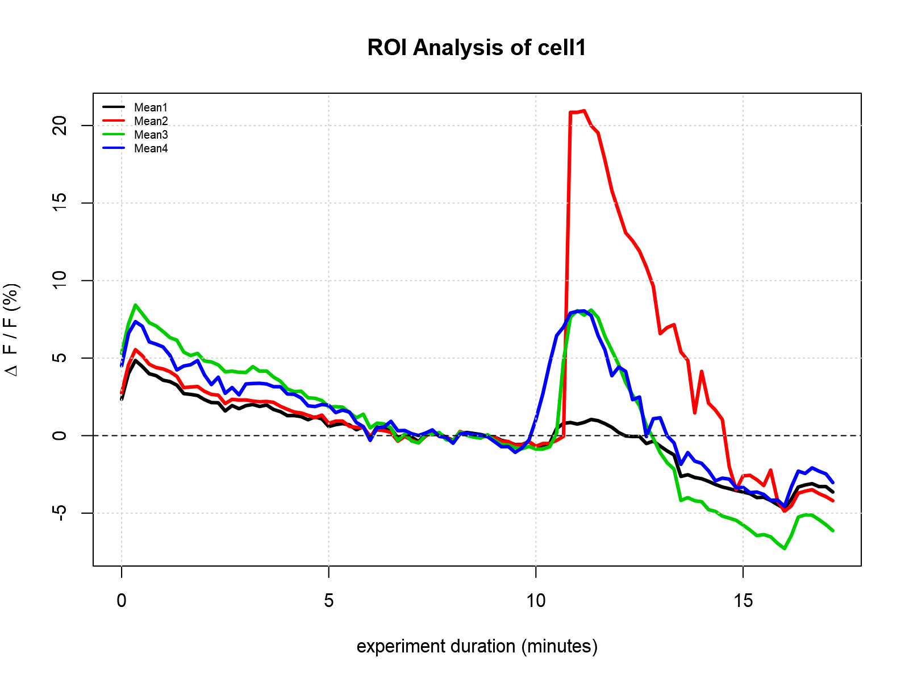
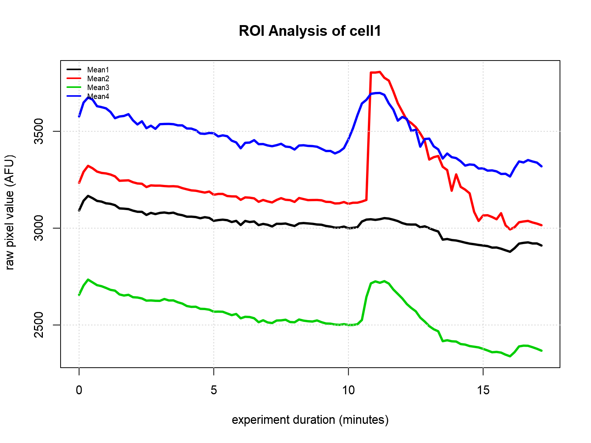

# Example: Plotting ROI Data
This example demonstrates how to make figures. If a plot command is called without a `saveAs` argument, it will be displayed (in RStudio). If you're running this from RScript, it will be saved as an `Rplots.pdf` file. If the intent is to save the file as a PNG, just give it a filename with the `saveAs` argument.

### Displaying figures in pop-up windows
```
ROI<-newRoiFolder("/some/roi/folder/")
plot_ROI_DFF(ROI)
plot_ROI_RAW(ROI)
```

### Saving figures as PNG files
```
ROI<-newRoiFolder("/some/roi/folder/)
plot_ROI_DFF(ROI, saveAs="someFile1.png"))
plot_ROI_RAW(ROI, saveAs="someFile2.png"))
```

# Output

