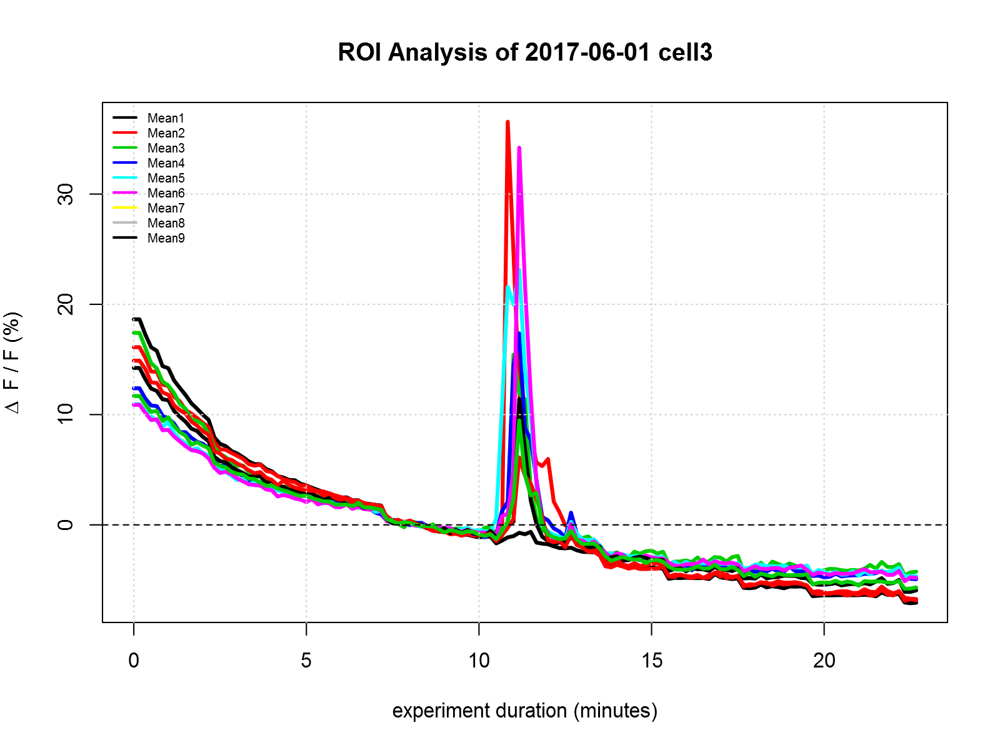

# boshROI Usage Examples
Each subfolder is a self-contained example script which shows how to use the boshROI package in some way. These scripts have an extra block of code at the top which loads the package using load_all() instead of library(). This means that you don't actually have to build and install the package every time you make a small change to it. The end user (who won't be modifying code inside the package) will not need that extra code.

### 001 - basic plot
