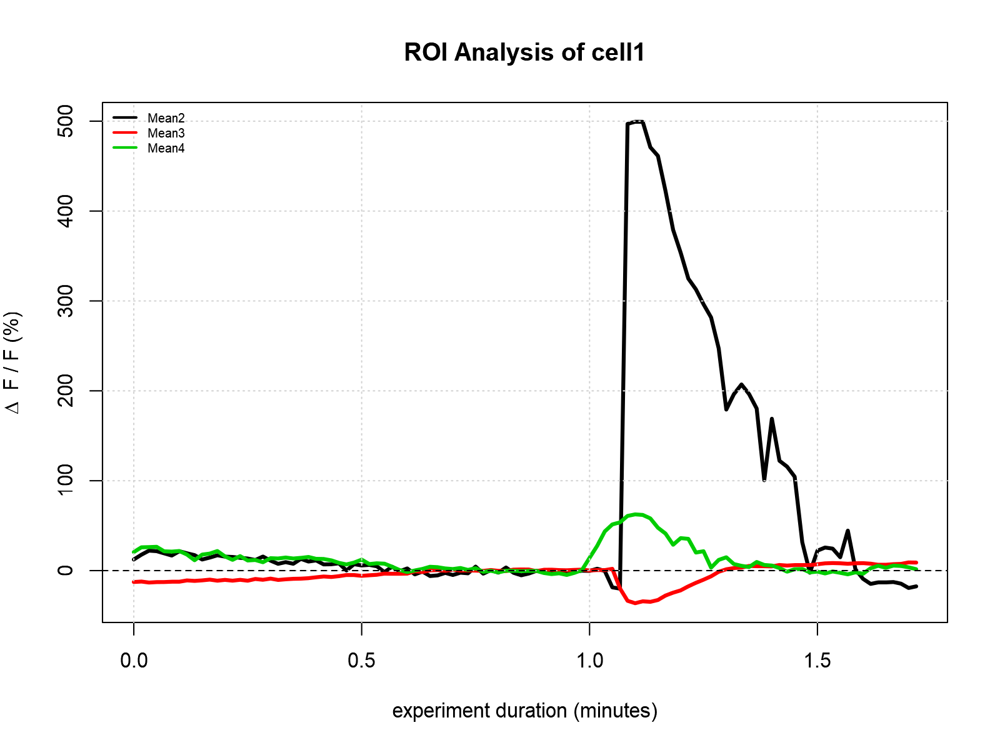
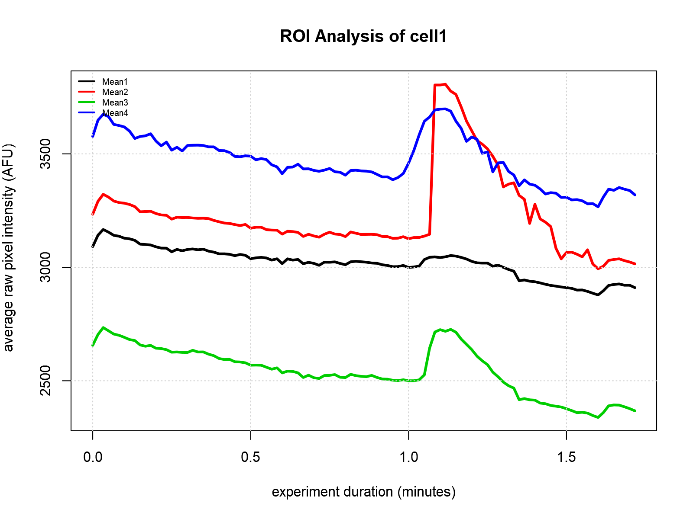

# Programming Outline
I think I have most of the conceptual stuff outlined in `04.R`. The core is the `RoiFolder` reference class. Just load it up giving it an ROI folder and it does the rest! It calls functions to load the data from the results.xls file, load the comments and baseline info from the experiment.txt file, and calculate dF/F. All those results just sit inside the RoiFolder object until it's desired.

My thinking is that now that we have these `RoiFolder` objects with easy access to all the data we want, we can keep thinking of new ways to analyze that data or graph that data without having to edit the code that lives inside the `RoiFolder` class.

## Output

