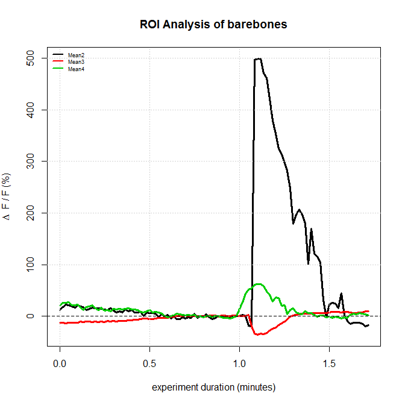

# BOSH ROI
BOSH ROI is an R Package developed assist in the analysis of calcium reporting fluorophores (i.e., FluoAM, Fluo-4 and GCaMP6) from time series images analyzed in [NIH ImageJ](https://imagej.nih.gov/ij/index.html) / [FIJI](http://fiji.sc/). The BOSH ROI package was initially developed by Beronica Ocasio and Scott Harden.

# Setup 
BOSH ROI is an R package that was developed and tested in [RStudio 1.0.143](https://www.rstudio.com/products/rstudio/) using [R 3.4.0](https://cran.rstudio.com/).

## Installing
To install the latest boshROI package version from GitHub, use these commands:
```R
install.packages("devtools")
library(devtools)
devtools::install_github("swharden/ROI-Analysis-Pipeline", subdir = "boshROI")
library(boshROI)
```

## Uninstalling
```R
remove.packages("boshROI")
```

## Updating
```R
library(devtools)
update_packages("boshROI")
```

# Example Usage 
Ensure your working directory is the root of a directory containing the ROI files you wish to analyze. This can be done in Rstudio through the dropdown menu "Session" > "Set Working Directory" > "Choose Directory...", or via the command ```setwd()``` in R.  

```R
library(boshROI)
setwd("X:/Data/SCOTT/2017-05-10 GCaMP6f/GCaMP6f PFC OXTR cre/2017-06-01 cell2")
ROI <- newRoiFolder("./")
plot_ROI_DFF(ROI)
```


# Advanced Functionality
Highly advanced functionality is demonstrated in [updated.R](../sandbox/beronica/updated.R): 
* Reading experiment text files to determine baseline and drug exposure times
* Automatic shading and labeling of baseline and drug exposure ranges
* Plot raw pixel intensity (AFU) or calcium signal (dF/F) 
* Graph signal of each ROI individually or average all ROIs together (with standard error)
* Read ROI data directly from an ImageJ ZIP file
* Output analysis data as an excel spreadsheet

