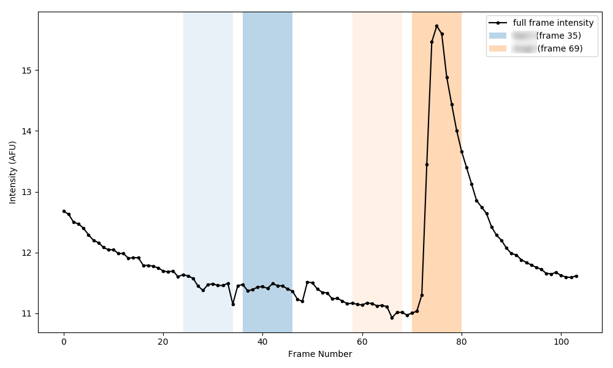
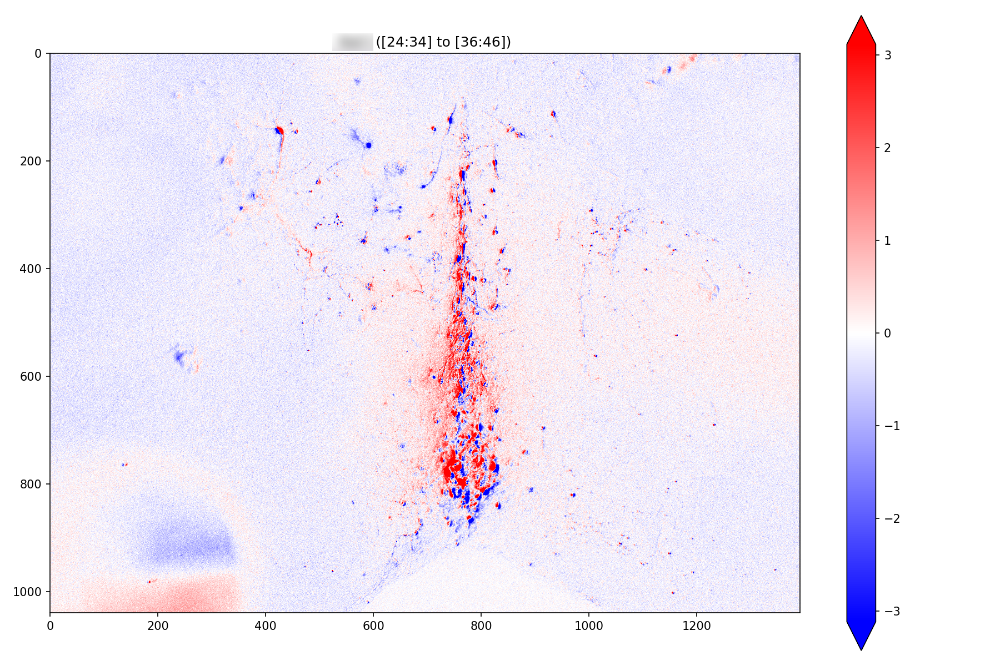

# Image Delta

The **imageDelta** project takes a folder of single-image TIFs, allows the user to enter a baseline range and a drug range (in frame number units), then creates an image showing the difference as a 2D heatmap.

## Example Use
```python
import imageDelta as id
folderPath = R"X:\some\path\to\video"
drugs = []
drugs.append(id.Drug("drug1", id.drugFrameFromFileList(10, folderPath)))
drugs.append(id.Drug("drug2", id.drugFrameFromFileList(20, folderPath)))
id.graphDrugExperiment(drugs, folderPath)
```



