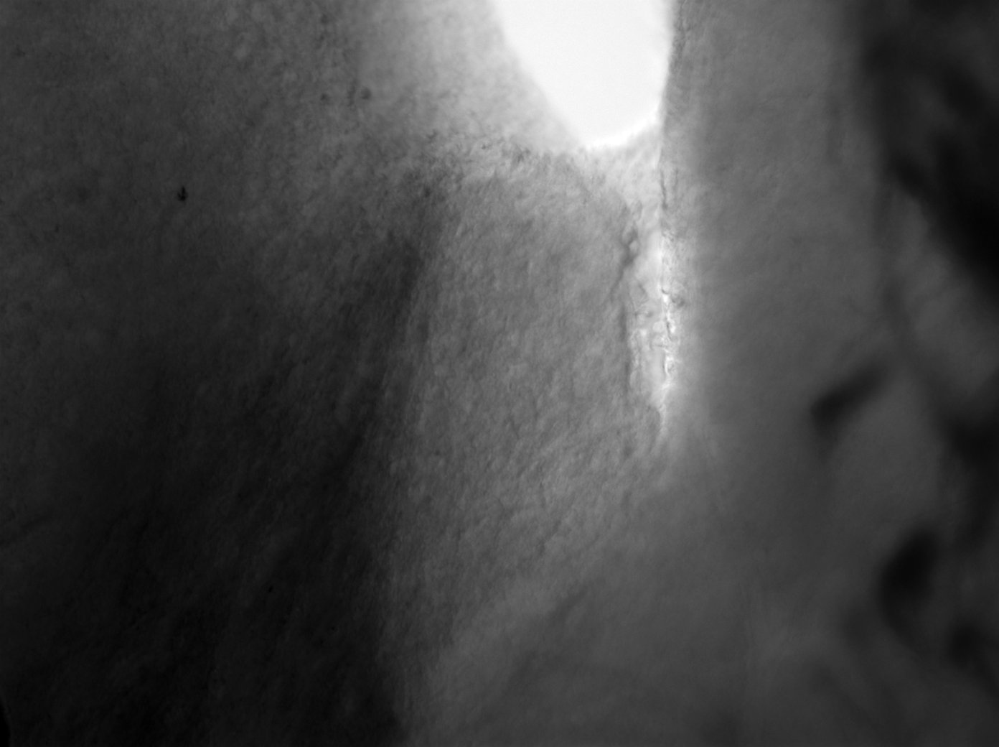
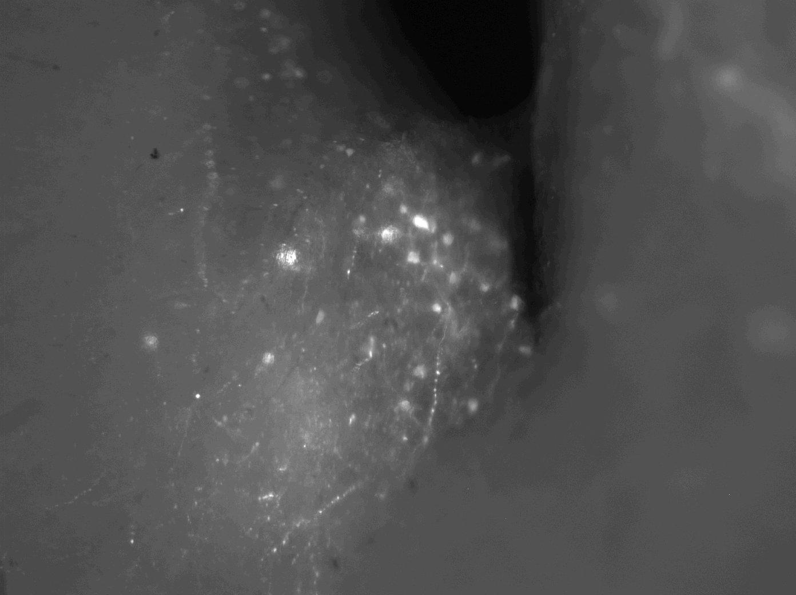
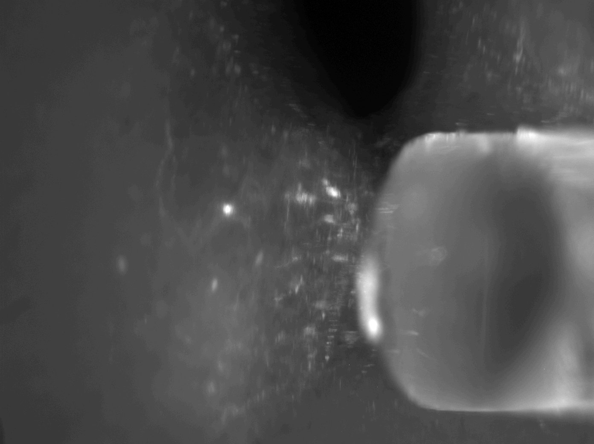
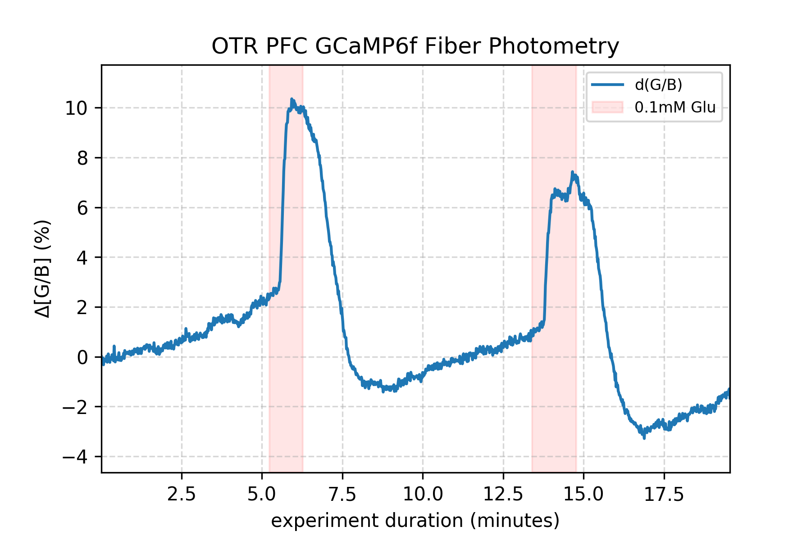
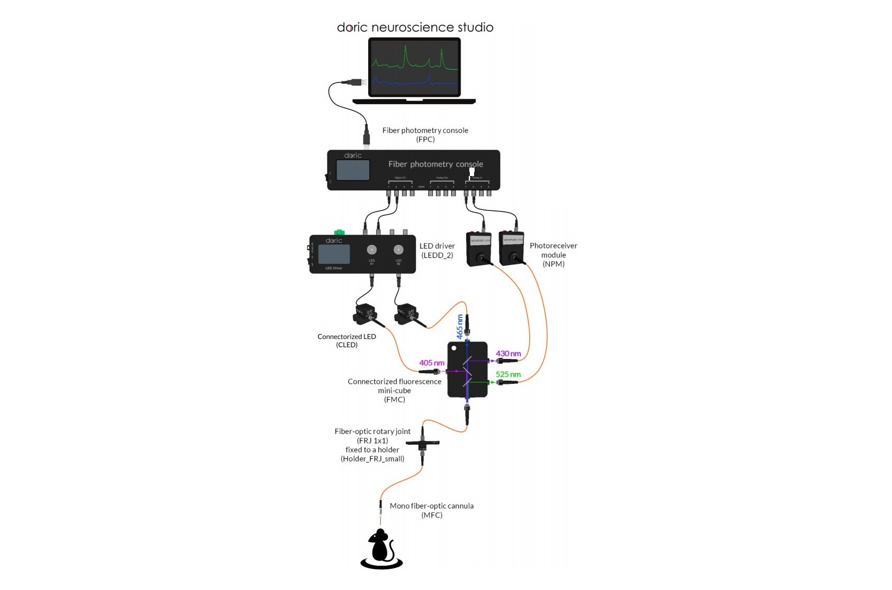

# pyPhotoPhotometry
This folder contains work relating to the development of code for exploratory data analysis of fiber photometry data. Experimental data is typically ratiometric fluorescence imaging of GCaMP6f in neurons.]

## Experiment
A 300 micron slice is placed in the chamber with continuously flowing ACSF. A fluorescent field (GCaMP6f+) is identified and the tip if the post is lowered to contact those cells. Fiber recordings then are taken with all regular microscopy illumination off.

**Video Output:** https://youtu.be/r5iyD7B55EE

DIC | Fluorescence | Post Placement
---|---|---
||



## Data File Format

### Photosensor Data (CSV)
```
Time(s),AnalogIn-1,AnalogIn-2,AnalogIn-3,AnalogIn-4,Sequence,TTL-1,TTL-2,TTL-3,TTL-4,AnalogOut-1,AnalogOut-2,AnalogOut-3,AnalogOut-4
0,0.909604,5.49486,2.49947,2.49886,1,0,0,0,0,0,0,0,0,
0.00268817,0.909299,5.48845,2.49947,2.49886,1,0,0,0,0,0,0,0,0,
0.00537634,0.91113,5.45824,2.49947,2.49886,1,0,0,0,0,0,0,0,0,
0.00806452,0.91052,5.46937,2.49947,2.49886,1,0,0,0,0,0,0,0,0,
0.010745,0.907773,5.49013,2.49947,2.49886,1,0,0,0,0,0,0,0,0,
0.0134332,0.909452,5.50264,2.49947,2.49886,1,0,0,0,0,0,0,0,0,
0.0161213,0.908536,5.51866,2.49947,2.49886,1,0,0,0,0,0,0,0,0,
0.0188095,0.901975,5.50279,2.49947,2.4987,1,0,0,0,0,0,0,0,0,
0.02149,0.909452,5.46861,2.49947,2.49886,1,0,0,0,0,0,0,0,0,
0.0241782,0.906858,5.45885,2.49947,2.49886,1,0,0,0,0,0,0,0,0,
0.0268663,0.910367,5.48921,2.49947,2.49886,1,0,0,0,0,0,0,0,0,
0.0295545,0.904874,5.49959,2.49947,2.49886,1,0,0,0,0,0,0,0,0,
0.032235,0.914182,5.51775,2.49947,2.49886,1,0,0,0,0,0,0,0,0,
0.0349232,0.913266,5.49928,2.49947,2.49886,1,0,0,0,0,0,0,0,0,
0.0376113,0.908841,5.4799,2.49947,2.49886,1,0,0,0,0,0,0,0,0,
0.0402995,0.907468,5.45839,2.49947,2.49886,1,0,0,0,0,0,0,0,0,
0.04298,0.906095,5.48112,2.49947,2.49886,1,0,0,0,0,0,0,0,0,
0.0456682,0.9064,5.48875,2.49947,2.49886,1,0,0,0,0,0,0,0,0,
0.0483563,0.913724,5.5179,2.49947,2.49886,1,0,0,0,0,0,0,0,0,
0.0510445,0.905789,5.49669,2.49947,2.49886,1,0,0,0,0,0,0,0,0,
0.053725,0.908841,5.47441,2.49947,2.49886,1,0,0,0,0,0,0,0,0,
0.0564132,0.907468,5.46449,2.49947,2.49886,1,0,0,0,0,0,0,0,0,
0.0591013,0.91052,5.47609,2.49947,2.4987,1,0,0,0,0,0,0,0,0,
...
```

### Experiment Notes (JSON)
```json
{
    "Timestamps": [
        {
            "Note": "glu 50",
            "Time": 429.45285951612902
        },
        {
            "Note": "glu 150",
            "Time": 573.52161751612903
        }
    ]
}

```

## Equipment
* [Docic Catalog](http://www.doriclenses.com/downloads/Product_catalog_RELEASE_WEB.pdf)
* LED Driver: [Doric 2 channel LED Driver](http://doriclenses.com/life-sciences/led-drivers/782-led-drivers.html)
* Software: [Doric Neuroscience Studio](http://doriclenses.com/life-sciences/software/955-doric-neuroscience-studio.html)



# Notes
## Converting TIFF series to video
```
ffmpeg.exe -framerate 30 -y -i "./TIFF/TIFF%%04d.tif" -c:v libx264 -pix_fmt yuv420p "render.mp4"
```
