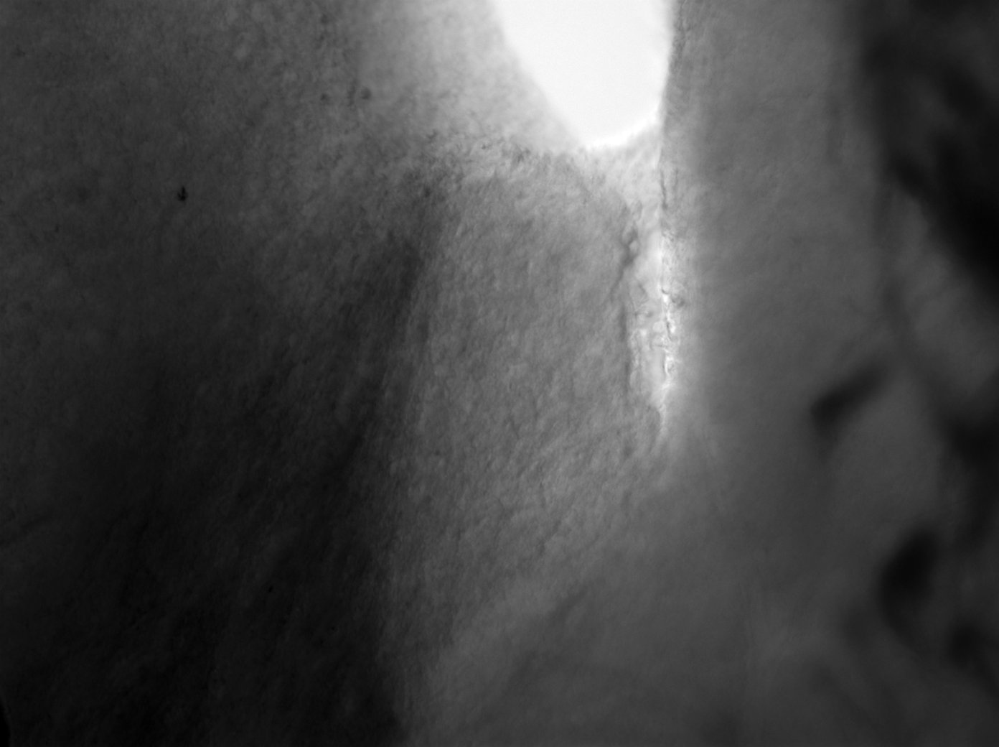
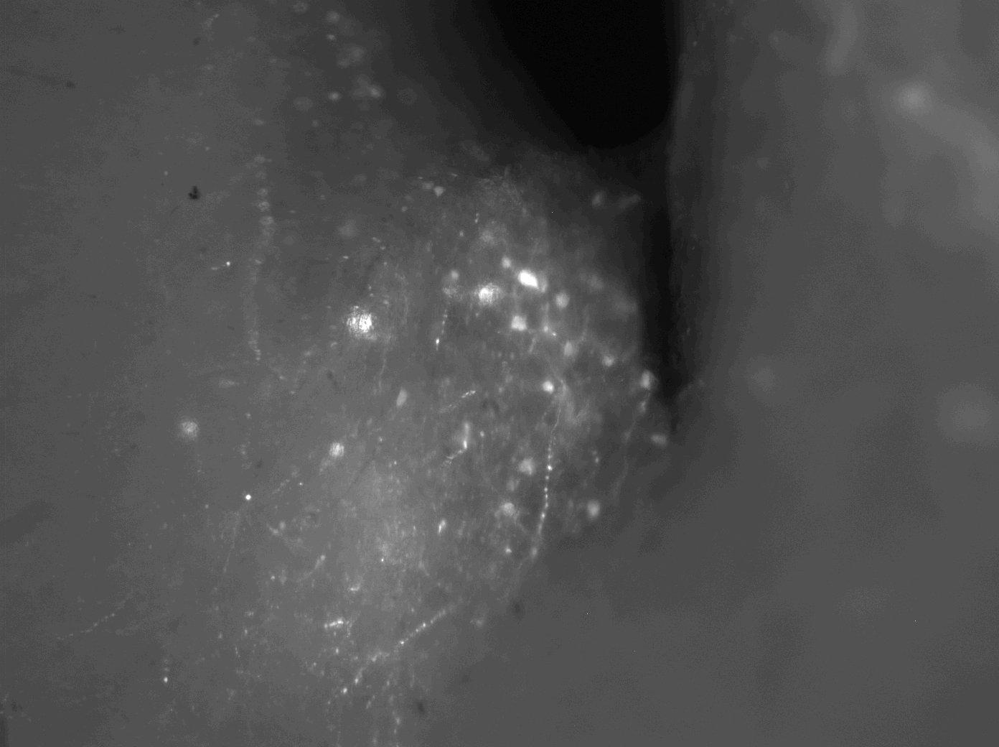
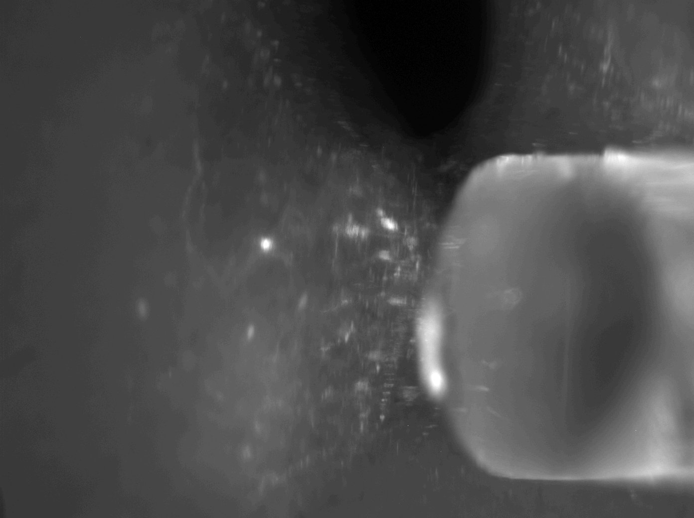
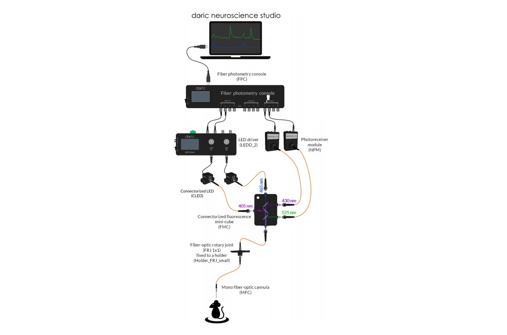

# pyPhotoPhotometry
This folder contains work relating to the development of code for exploratory data analysis of fiber photometry data. Experimental data is typically ratiometric fluorescence imaging of GCaMP6f in neurons.]

## Experiment
A 300 micron slice is placed in the chamber with continuously flowing ACSF. A fluorescent field (GCaMP6f+) is identified and the tip if the post is lowered to contact those cells. Fiber recordings then are taken with all regular microscopy illumination off.

DIC | Fluorescence | Post Placement
---|---|---
||

## Equipment
* [Docic Catalog](http://www.doriclenses.com/downloads/Product_catalog_RELEASE_WEB.pdf)
* LED Driver: [Doric 2 channel LED Driver](http://doriclenses.com/life-sciences/led-drivers/782-led-drivers.html)
* Software: [Doric Neuroscience Studio](http://doriclenses.com/life-sciences/software/955-doric-neuroscience-studio.html)

