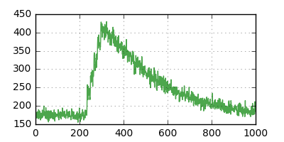
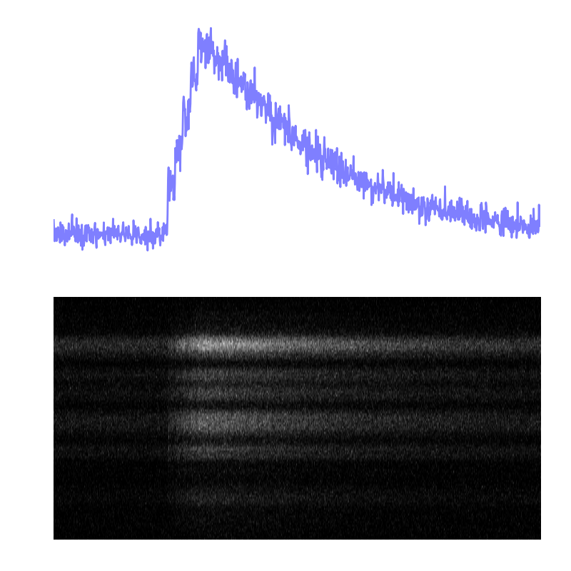
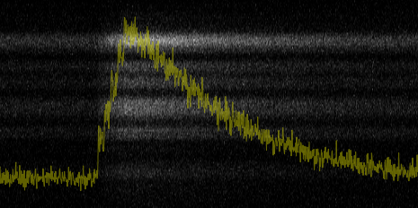

# Python Analsys of Linescan Images
These scripts demonstrate how to turn a 2D linescan TIF into a linescan intensity plot. 

## Linescan Conversion
[summary.py](summary.py) has extra lines and comments. [minimal.py](minimal.py) is code only and generates the graph in only 4 lines! The key code is here:
```
imageData=plt.imread("../../data/linescan/example/green.tif") # load the image
trace=np.average(imageData,axis=1) # get the average (vertically)
plot(trace) # draw the trace
```


## Displaying Graphs and Images
[imageDisplay.py](imageDisplay.py) shows how to plot a trace next to an image. Note that by using different colormaps you can create different outputs. Online are [lists of colormap names you can use](https://matplotlib.org/examples/color/colormaps_reference.html). Changing the colormap to red, green, or magenta is an easy way to convert a gray image into a color one. The key code is here:
```
imageData=plt.imread("../../data/linescan/example/green.tif") # load the image
plt.imshow(np.rot90(imageData), cmap='gray', aspect='auto') # draw the image
```
### Output when cmap='gray'


### Output when cmap='jet'


## Displaying Graphs above Images
[imageOverlap.py](imageOverlap.py) example shows how to create a graph drawn directly on a graph. These are starting to get to be advanced examples, but it might be useful. Key code is:
```
plt.plot(trace,alpha=.5,color='y',lw=.5) # plot the data first
plt.margins(0,.1) # adjust margins so it's flush horizontally and padded vertically
plt.imshow(np.rot90(imageData), cmap='gray', aspect='auto', extent=plt.axis()) # draw image
plt.axis('off') # hide all axis stuff
plt.gca().get_xaxis().set_visible(False) # remove X axis
plt.gca().get_yaxis().set_visible(False) # remove Y axis
plt.savefig("output_overlap.png",dpi=200,bbox_inches='tight',pad_inches=0) # extra options prevent whitespace
```
