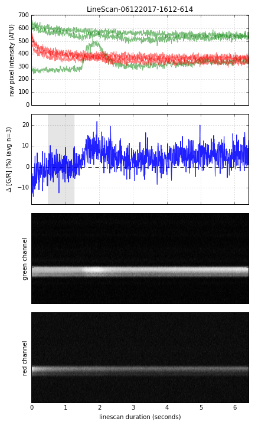

# pyLineScan
pyLineScan is a Python module intended to make it easy to access, analyze, and display data from PrairieView linescan folders. When the`LineScan` class is initialized with a path to a linescan folder, it automatically scans the folder for linescan images and reads the XML and ENV files to determine their framerate. Vertically-averaged traces of red, green, and delta(green/red) are immediately available. Plotting functions exist as well to rapidly visualize the experiment performed. These scripts are a sandbox of experimental code maintained by Scott Harden.

## Usage
```python
import pyLineScan # assuming pyLineScan.py is in the same folder
LS=pyLineScan.LineScan('/path/to/folder/',baseline=[1.5,2]) # init with a path and a baseline region in seconds
print(LS.traceG[0]) # show the green values from the first linescan
LS.figureDual("demo.png")
```

**Example Output (text)**
```
[-0.0929349  -0.04921378 -0.05045224 ...,  0.2000458   0.21029908
  0.14951943]
```

**Example Output (figure)**


## Processing Multiple Folders
[processFolders.py](processFolders.py) is a script to automatically generate a linescan graph for every linescan found in a folder. Now they can be easily browsed with a web interface. Convension is that linescan output data is stored in the linescan folder's `./analysis/` folder.