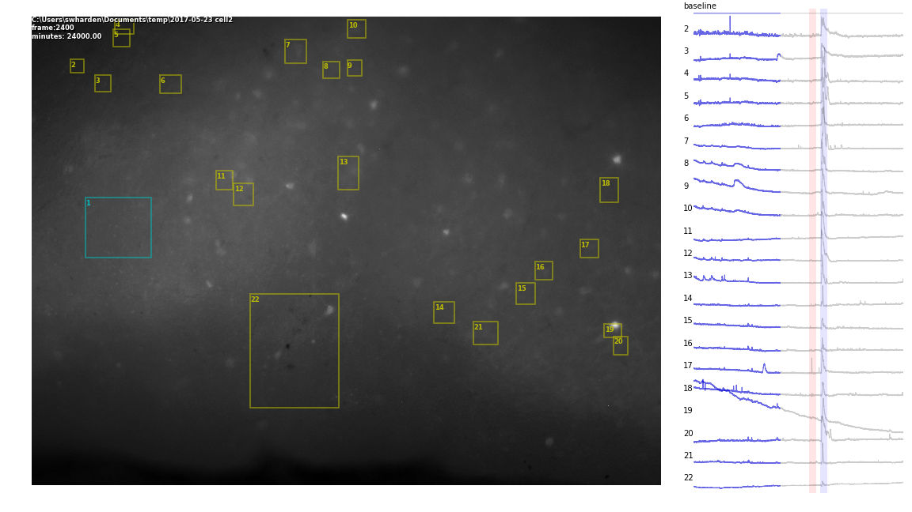

# Python Scripts for ROI/Video Analysis
These scripts are a sandbox of experimental code maintained by Scott Harden. 

### Simple Demo


### Video Render Demo
read original image file, ROI zip file, do the analysis, and output frames ready to create a video from


### Video Rendering with FFMPG
If every frame of a video is saved in a folder as a numbered series of PNG files, this command can be used to convert it to a HTML5-compatible MP4 video:

```
ffmpeg.exe -framerate 10 -y -i "./pics/frame_%%07d.png" -c:v libx264 -pix_fmt yuv420p "render.mp4"
```